# Organization Management Service  
### Backend Intern Assignment – FastAPI + MongoDB (Multi-Tenant Architecture)

This project implements a **multi-tenant backend service** where each organization gets its own isolated MongoDB collection.  
A **Master Database** stores organization metadata and admin credentials.  
Dynamic collections (`org_<organization_name>`) are created for every new organization.

Technologies used: **FastAPI**, **MongoDB (Motor)**, **JWT**, **Argon2 Hashing**, **Pydantic Settings**

---

## Features

### Multi-Tenant Design
- Automatically creates a MongoDB collection for each new organization  
- Format: `org_<organization_name>`

### Master Database
Stores:
- Organization name  
- Collection reference  
- Admin reference  
- Connection details  

### Admin Authentication
- JWT-based login  
- Passwords hashed using **Argon2** (more secure than bcrypt)

###  Organization Management
- Create new organization  
- Get organization details  
- Update organization info  
- Delete organization (admin-authenticated)

---

#  Project Structure
```md
org-mgmt-service/
├─ app/
│  ├─ main.py
│  ├─ config.py
│  ├─ db.py
│  ├─ auth.py
│  ├─ schemas.py
│  ├─ routers/
│  │   ├─ orgs.py
│  │   └─ admin.py
├─ docker-compose.yml
├─ requirements.txt
├─ README.md
└─ .gitignore
```


---

#  Installation & Setup

## 1.Clone the Repository
```bash
git clone https://github.com/<your-username>/<repo-name>.git
cd <repo-name>
```
## 2.Create & Activate Virtual Environment
```bash
python3.11 -m venv venv
source venv/bin/activate
```
## 3.Install Dependencies
```bash
pip install -r requirements.txt
```
## If requirements file not present:
```bash
pip install fastapi uvicorn[standard] motor pydantic-settings \
passlib[argon2] argon2-cffi PyJWT python-dotenv email-validator

```

#  Installation & Setup
## Start MongoDB (macOS – Homebrew)
```bash
brew services start mongodb-community@7.0
```
## OR Using Docker
```bash
docker run -d -p 27017:27017 --name mongo mongo:7
```

# Environment Variables

Create a `.env` file inside the project root and add:

```env
MONGO_URI=mongodb://localhost:27017
MASTER_DB=master_db
JWT_SECRET=super_secret_key
JWT_ALGORITHM=HS256
ACCESS_TOKEN_EXPIRE_SECONDS=3600
```
(Do NOT commit .env to GitHub)

# Run the Application
```bash
uvicorn app.main:app --reload
```


# Swagger Documentation

Once the server is running, access Swagger UI at:

👉 http://127.0.0.1:8000/docs


# API Endpoints
## 1. Create Organization
POST /org/create
```json
{
  "organization_name": "sampleco",
  "email": "admin@sample.com",
  "password": "pass123"
}
```
Response:
```json
{
  "organization_name": "sampleco",
  "collection_name": "org_sampleco",
  "admin_email": "admin@sample.com"
}
```
## 2. Admin Login
POST /admin/login
```json
{
  "email": "admin@sample.com",
  "password": "pass123"
}
```
Response:
```json
{
  "access_token": "<JWT>",
  "token_type": "bearer"
}
```
Use the token in Swagger via Authorize → Bearer <token>.

## 3. Delete Organization (Protected)
DELETE /org/delete/organization_name=sampleco
-Requires JWT token.
Response:
```json
"Organization deleted successfully"
```

## High-Level Architecture Diagram

```mermaid
flowchart TB

    subgraph CLIENT["👤 Client / Admin"]
        A1["Browser / API Client"]
    end

    subgraph API["⚡ FastAPI Application Layer"]
        A2["Routers (orgs, admin)"]
        A3["Auth Layer (JWT, Argon2)"]
        A4["Pydantic Schemas"]
    end

    subgraph MASTERDB["🗄️ Master MongoDB (Global Metadata)"]
        M1["organizations Collection"]
        M2["admins Collection"]
        M3["connection_details (optional)"]
    end

    subgraph TENANTDB["📦 Dynamic Tenant Collections"]
        T1["org_sampleco"]
        T2["org_company_x"]
        T3["org_<organization_name>"]
    end

    A1 -->|HTTP Requests| A2
    A2 --> A3
    A2 -->|CRUD Ops| MASTERDB
    A2 -->|Dynamic Create/Delete| TENANTDB
```





## Design Decisions

### Multi-Tenant Approach
Each organization gets its own isolated collection → ensures clean data separation and prevents data leakage.

### Master DB
A central database that stores global metadata and organization details → simplifies management and onboarding.

### Argon2 Password Hashing
Uses a modern, memory-hard hashing algorithm for admin authentication → avoids the compatibility issues seen with bcrypt.

### JWT Authentication
Stateless authentication system for secure admin login and token-based access.

### FastAPI
- High performance (based on Starlette + Uvicorn)
- Automatic interactive API documentation (Swagger & ReDoc)
- Excellent developer experience and async support

## Trade-Offs

| **Pros**                               | **Cons**                                                              |
|----------------------------------------|-----------------------------------------------------------------------|
| Easy to isolate organization data      | Many collections may impact DB performance if tenant count is high   |
| Fast dynamic creation                  | Harder to run cross-tenant analytics                                 |
| Simple architecture                    | Scaling requires careful planning                                     |

Alternative: Use one shared collection with a tenant_id field (scales better for many small tenants).


## Author

**Anuchand C**  
The Wedding Company 2025  
[LinkedIn](https://www.linkedin.com/in/anuchand-chelladurai/)


